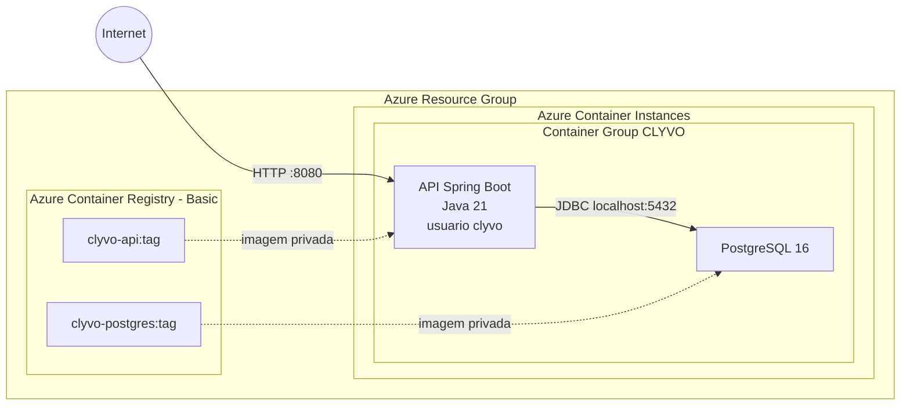

# CLYVO API

Backend REST do CLYVO, uma aplicação veterinária que conecta Tutores, Veterinários e Animais. O sistema organiza vínculos, consultas, prontuários, prescrições, exames, vacinações, notificações, conversas e indicadores do Veterinário.

## Descrição da Solução

A API usa Java 21, Spring Boot 4.0.6, Spring MVC, Spring Data JPA/Hibernate e PostgreSQL 16. O profile `local` usa PostgreSQL, `prod` recebe conexão exclusivamente por variáveis de ambiente e valida o schema criado por `database/script_bd.sql`, `render` usa H2 em memória com seed automático de demonstração e `test` usa H2 em memória para a suíte automatizada.

O deploy acadêmico validado segue a opção ACR + ACI aprovada pelo professor: um único Azure Container Instance/Container Group contém a API e o PostgreSQL. A API acessa o banco por `localhost:5432`; apenas a porta `8080` é pública. O PostgreSQL usa o filesystem interno do container.

> O fluxo foi validado de ponta a ponta com Docker, ACR e ACI. Como não há volume externo, recriar ou excluir o Container Group perde os dados; use somente dados fictícios de demonstração.

## Benefícios para o Negócio

- Centralização do histórico clínico dos animais.
- Comunicação persistente entre Tutor e Veterinário.
- Acompanhamento de tratamento, prescrições, exames e vacinações.
- Gestão de consultas e organização das informações de saúde animal.
- Indicadores operacionais para apoiar a tomada de decisão veterinária.

## Arquitetura Cloud



Não fazem parte desta solução: App Service, Azure Database for PostgreSQL, VNet, NAT Gateway, Application Gateway, AKS ou dois ACIs separados.

## Pré-Requisitos

- Git.
- Docker Engine com Docker Compose.
- Azure CLI.
- Subscription Azure ativa.
- `curl` e Python 3 para os scripts.
- JDK 21 apenas para desenvolvimento/testes fora do container.
- Maven não precisa ser instalado: o repositório possui Maven Wrapper.

## Configuração

Clone o repositório real do backend:

```bash
git clone https://github.com/MuriloMacedoSilva/Api-challenge-clyvo.git
cd Api-challenge-clyvo
```

Crie o arquivo local ignorado pelo Git:

```bash
install -m 600 .env.example .env
```

Edite `.env` e substitua todos os placeholders. Campos Azure vazios são derivados automaticamente de `UNIQUE_SUFFIX`, mas podem ser preenchidos para sobrescrever os nomes. Use linhas literais `NOME=VALOR`, sem comandos, expansão de shell ou aspas. Uma senha hexadecimal longa evita diferenças de parsing entre ferramentas. Use um `UNIQUE_SUFFIX` reproduzível, contendo somente letras minúsculas e números. Use a mesma senha forte em `POSTGRES_PASSWORD` e `DB_PASSWORD` para o desenvolvimento local.

Variáveis usadas:

| Variável | Finalidade |
|---|---|
| `POSTGRES_DB`, `POSTGRES_USER`, `POSTGRES_PASSWORD` | Inicialização e acesso ao PostgreSQL |
| `DB_URL`, `DB_USERNAME`, `DB_PASSWORD` | Datasource da API fora do Compose |
| `UNIQUE_SUFFIX` | Sufixo reproduzível para nomes globais |
| `AZURE_SUBSCRIPTION_ID` | Subscription que todos os scripts conferem antes de operar |
| `AZURE_LOCATION` | Região Azure, padrão documentado `brazilsouth` |
| `RESOURCE_GROUP` | Resource Group exclusivo da entrega |
| `ACR_NAME` | Registry globalmente único |
| `ACI_NAME` | Nome do Container Group |
| `DNS_NAME_LABEL` | Label configurável do FQDN público |
| `IMAGE_TAG` | Tag explícita das duas imagens, por exemplo `v1` |

Nenhuma senha ou credencial ACR deve ser commitada.

## Execução Local

O Compose constrói e inicia `api` + `postgres`. A API usa `jdbc:postgresql://postgres:5432/clyvo`, depende do healthcheck do banco e também executa sua própria espera autenticada. O volume nomeado preexistente `clyvo-postgres-data` continua montado em `/var/lib/postgresql/data`.

```bash
docker compose build
docker compose up -d
docker compose ps
curl http://localhost:8080/tutor/ping
```

O DDL em `/docker-entrypoint-initdb.d/001-schema.sql` só é executado pelo PostgreSQL quando o volume está vazio. Volumes locais já existentes continuam com o schema mantido pelo profile `local`, cujo `ddl-auto` permanece `update`.

Seed local manual e destrutivo:

```bash
docker compose exec -T postgres sh -c 'PGPASSWORD="$POSTGRES_PASSWORD" psql -U "$POSTGRES_USER" -d "$POSTGRES_DB" -f /seed/demo-data-postgres.sql'
```

Parar sem apagar dados:

```bash
docker compose stop
docker compose start
```

Não use `docker compose down -v` se quiser preservar o volume.

## Imagens

### API

O `Dockerfile` usa `maven:3.9.15-eclipse-temurin-21` no build e `eclipse-temurin:21-jre-jammy` no runtime. Maven e fontes não ficam na imagem final. O usuário final é `clyvo`, e o script `wait-for-postgres.sh` usa o cliente PostgreSQL para confirmar `SELECT 1` antes de executar `java -jar`.

### PostgreSQL

O `Dockerfile.postgres` deriva de `postgres:16`. O schema é copiado para `/docker-entrypoint-initdb.d/001-schema.sql`. O seed não é automático: `demo-data.sql`, `demo-data-postgres.sql` e `demo-verification.sql` ficam em `/seed`.

## Schema e Profiles

`database/script_bd.sql` contém 13 tabelas correspondentes às 13 Entities atuais, com PKs identity, FKs, unicidades, `NOT NULL`, checks dos enums, `item_order`, índices e comentários PostgreSQL. Não contém `DROP`, `TRUNCATE` ou dados.

- `local`: `ddl-auto=update`, preservado para compatibilidade com bancos locais existentes.
- `prod`: `ddl-auto=validate`; o schema deve existir antes da API iniciar.
- `render`: `ddl-auto=create` sobre H2 em memória; cria um schema novo e a massa demo a cada inicialização.
- `test`: `ddl-auto=create-drop` sobre H2 em memória.

Não foi introduzido Flyway/Liquibase. Para esta entrega acadêmica, o entrypoint da imagem PostgreSQL cria o schema em volume vazio; migrations versionadas continuam recomendadas para produção real.

## Deploy gratuito no Render

O ambiente Render existe exclusivamente para o professor de Frontend testar a API sem depender da infraestrutura paga da Azure. Ele executa um Web Service Docker no plano Free, ativa o profile `render` e usa H2 em memória. Não crie Render Postgres nem configure `DB_URL`, `DB_USERNAME` ou `DB_PASSWORD` nesse serviço.

O `render.yaml` permite criar o serviço como Blueprint. Ele reutiliza o `Dockerfile` da API, configura `SPRING_PROFILES_ACTIVE=render`, limita a JVM com `JAVA_TOOL_OPTIONS=-Xms128m -Xmx384m` e usa `GET /tutor/ping` como health check. A aplicação escuta em `0.0.0.0` e usa a variável `PORT` fornecida pelo Render, com fallback local para `10000`.

Para criar pelo Dashboard sem Blueprint:

1. Crie um Web Service a partir deste repositório GitHub.
2. Selecione o runtime Docker e o plano Free.
3. Defina `SPRING_PROFILES_ACTIVE=render`.
4. Opcionalmente, defina `JAVA_TOOL_OPTIONS=-Xms128m -Xmx384m`; o Blueprint já inclui esse limite.
5. Faça o deploy e acesse a URL `https://<nome-do-servico>.onrender.com`.

Como alternativa, escolha New > Blueprint no Render e aponte para o repositório que contém `render.yaml`. O Blueprint cria somente a API, sem banco ou secrets externos.

Credenciais fictícias criadas automaticamente:

| Perfil | CPF | CRMV | Senha |
|---|---|---|---|
| Tutor demo (Mariana Oliveira) | `12345678901` | Não se aplica | `12345678` |
| Veterinário demo (Dr. Gabriel Martins) | `98765432100` | `12345/SP` | `12345678` |

O initializer exclusivo `RenderDemoDataInitializer`, ativado somente pelo profile `render`, usa repositories em uma transação para criar estados finais coerentes sem disparar notificações ou transições de negócio durante o boot. Antes de inserir, ele verifica o CPF do Tutor demo, evitando duplicação se for chamado novamente na mesma instância. A massa contém Luna, Mingau e Thor, vínculo aceito, consultas, prontuário, prescrição, exames, vacinas e uma conversa com mensagens. Esses dados deixam as listagens, os detalhes clínicos, o chat e o dashboard do Veterinário com conteúdo demonstrável.

### Limitações do ambiente Render

- O H2 é volátil e existe somente na memória do processo.
- Restart, redeploy ou encerramento do serviço apaga os dados; o initializer recria automaticamente a mesma massa no próximo boot.
- O serviço Free pode dormir após inatividade e a primeira requisição depois disso pode levar cerca de um minuto.
- O Render não representa produção e não deve receber dados reais.
- O deploy acadêmico oficial de DevOps continua sendo Azure ACR/ACI com PostgreSQL e permanece independente desta configuração.
- O CORS amplo já declarado pelos controllers foi preservado, portanto o frontend web pode acessar a URL pública do Render sem cadastrar um domínio ainda desconhecido.

## Login Azure Manual

O login não é automatizado:

```bash
az login
az account show
```

Se necessário, escolha explicitamente a subscription:

```bash
az account set --subscription "<SUBSCRIPTION_ID_OU_NOME>"
az account show
```

## Ordem dos Scripts

Execute a partir da raiz do backend, nesta ordem:

```bash
./azure/scripts/00-check-prerequisites.sh
./azure/scripts/01-create-resources.sh
./azure/scripts/02-build-push-images.sh
./azure/scripts/03-deploy.sh
./azure/scripts/05-status.sh
./azure/scripts/04-seed-demo.sh
./azure/scripts/06-test.sh
```

| Script | Responsabilidade |
|---|---|
| `00-check-prerequisites.sh` | Verifica Azure CLI, Docker, curl, Python, login, subscription, variáveis e nomes |
| `01-create-resources.sh` | Cria Resource Group e ACR Basic |
| `02-build-push-images.sh` | Faz login no ACR, build, tag e push das duas imagens |
| `03-deploy.sh` | Obtém credenciais, renderiza YAML temporário, cria o Container Group e mostra o FQDN |
| `04-seed-demo.sh` | Executa manualmente o seed destrutivo no container PostgreSQL |
| `05-status.sh` | Mostra recursos, containers, estados, IP e FQDN sem secrets |
| `06-test.sh` | Testa `/tutor/ping` e `/v3/api-docs` |
| `99-destroy.sh` | Remove o Resource Group após confirmação explícita |

## Comandos Principais Usados

Os scripts deixam visíveis os comandos exigidos pela disciplina. O fluxo utiliza, entre outros:

```bash
az group create --name "$RESOURCE_GROUP" --location "$AZURE_LOCATION"
az acr create --resource-group "$RESOURCE_GROUP" --name "$ACR_NAME" --sku Basic --admin-enabled true
az acr login --name "$ACR_NAME"
docker build --file Dockerfile --tag "clyvo-api:$IMAGE_TAG" .
docker build --file Dockerfile.postgres --tag "clyvo-postgres:$IMAGE_TAG" .
docker tag "clyvo-api:$IMAGE_TAG" "$ACR_NAME.azurecr.io/clyvo-api:$IMAGE_TAG"
docker tag "clyvo-postgres:$IMAGE_TAG" "$ACR_NAME.azurecr.io/clyvo-postgres:$IMAGE_TAG"
docker push "$ACR_NAME.azurecr.io/clyvo-api:$IMAGE_TAG"
docker push "$ACR_NAME.azurecr.io/clyvo-postgres:$IMAGE_TAG"
az container create --resource-group "$RESOURCE_GROUP" --file /tmp/clyvo-container-group.<temporario>.yaml
az container show --resource-group "$RESOURCE_GROUP" --name "$ACI_NAME"
az container logs --resource-group "$RESOURCE_GROUP" --name "$ACI_NAME" --container-name clyvo-api
az container exec --resource-group "$RESOURCE_GROUP" --name "$ACI_NAME" --container-name clyvo-api --exec-command whoami
```

`docker run` individual não é usado no deploy, pois o destino é um Container Group ACI. Para uma prova local opcional de usuário, depois do build:

```bash
docker run --rm --entrypoint whoami "clyvo-api:$IMAGE_TAG"
```

## Template ACI e Secrets

`azure/container-group.template.yaml` define exatamente um Container Group e dois containers. O PostgreSQL declara a porta interna `5432`, mas `ipAddress.ports` publica somente `8080`. No ACI, a API recebe:

```text
SPRING_PROFILES_ACTIVE=prod
DB_URL=jdbc:postgresql://localhost:5432/<POSTGRES_DB>
```

O PostgreSQL não recebe `PGDATA`, volume ou mount customizado. O template commitado contém apenas placeholders. `03-deploy.sh` consulta `az acr credential show`, renderiza valores como escalares JSON válidos em um arquivo `0600` sob `/tmp`, remove secrets do ambiente, chama `az container create --output none` e remove o diretório temporário via `trap`. A solução acadêmica usa o admin user do ACR pela simplicidade; credenciais não são versionadas. O label DNS usa escopo `ResourceGroupReuse` contra reutilização insegura.

O endpoint acadêmico é HTTP na porta `8080`, pois TLS/proxy está fora da arquitetura aprovada. Use somente dados fictícios durante a apresentação; esta exposição não é adequada para produção real.

## Status, Logs e Exec

```bash
source azure/scripts/_common.sh
load_config
./azure/scripts/05-status.sh

az container logs \
  --resource-group "$RESOURCE_GROUP" \
  --name "$ACI_NAME" \
  --container-name clyvo-api

az container logs \
  --resource-group "$RESOURCE_GROUP" \
  --name "$ACI_NAME" \
  --container-name clyvo-postgres
```

Entrar no PostgreSQL:

```bash
az container exec \
  --resource-group "$RESOURCE_GROUP" \
  --name "$ACI_NAME" \
  --container-name clyvo-postgres \
  --exec-command "/bin/sh"
```

Executar diretamente as consultas de verificação, sem pager:

```bash
az container exec \
  --resource-group "$RESOURCE_GROUP" \
  --name "$ACI_NAME" \
  --container-name clyvo-postgres \
  --exec-command "psql --pset=pager=off --username=$POSTGRES_USER --dbname=$POSTGRES_DB --file=/seed/demo-verification.sql"
```

Dentro do container:

```bash
psql --pset=pager=off --username="$POSTGRES_USER" --dbname="$POSTGRES_DB"
```

Consultas úteis:

```sql
SELECT * FROM animal ORDER BY id;
SELECT * FROM tb_vaccinations ORDER BY id;
SELECT a.id, a.name, t.name AS tutor
FROM animal a JOIN tutor t ON t.id = a.tutor_id
ORDER BY a.id;
```

O arquivo `/seed/demo-verification.sql` contém contagens e joins prontos:

```bash
psql --pset=pager=off --username="$POSTGRES_USER" --dbname="$POSTGRES_DB" --file=/seed/demo-verification.sql
```

## Seed no ACI

O seed é intencionalmente manual porque limpa todas as tabelas antes de recriar a massa. O script exige confirmação e aguarda uma conexão PostgreSQL autenticada:

```bash
./azure/scripts/04-seed-demo.sh
```

Internamente, o script usa `az container exec --container-name clyvo-postgres` e executa `/seed/demo-data-postgres.sql` com `psql`. O seed fornece pelo menos dois registros significativos relacionados: as vacinações V10 e Antirrábica de Luna, além do Tutor e Veterinário associados.

## CRUD Acadêmico

O par CORE validado é `Animal + Vaccination`, relacionado por `tb_vaccinations.animal_id`. Ambos possuem CREATE, READ, UPDATE e DELETE. A exclusão de Vaccination exige o Veterinário autor e vínculo `ACCEPTED` com o Tutor.

### Demonstração Disponível: Animal

Defina o endpoint retornado por `05-status.sh`:

```bash
export BASE_URL="http://<FQDN>:8080"
```

CREATE:

```bash
curl --fail --request POST "$BASE_URL/tutor/12345678901/create-animal" \
  --header 'Content-Type: application/json' \
  --data '[{"name":"Aurora Video","weight":8.4,"height":0.39,"age":3,"race":"Beagle","species":"Cachorro","history":"Registro criado durante a demonstracao."}]'
```

Anote o ID retornado e configure:

```bash
export ANIMAL_ID=<ID_RETORNADO>
```

READ:

```bash
curl --fail "$BASE_URL/tutor/12345678901/read-animals"
```

UPDATE:

```bash
curl --fail --request PUT "$BASE_URL/tutor/12345678901/animals/$ANIMAL_ID" \
  --header 'Content-Type: application/json' \
  --data '{"name":"Aurora Video","weight":8.9,"height":0.40,"age":4,"race":"Beagle","species":"Cachorro","history":"Peso atualizado durante a demonstracao."}'
```

DELETE, após os SELECTs:

```bash
curl --fail --request DELETE "$BASE_URL/tutor/12345678901/animals/$ANIMAL_ID"
```

No `psql`, após cada operação:

```sql
SELECT id, tutor_id, name, weight, height, age, race, species, history
FROM animal
WHERE id = <ANIMAL_ID>;
```

### Demonstração: Vaccination

Use um animal do seed, por exemplo Luna (`animalId=1`), e o Veterinário vinculado de CPF demonstrativo `98765432100`.

CREATE:

```bash
curl --fail --request POST "$BASE_URL/v1/vaccinations/animals/1?veterinarianCpf=98765432100" \
  --header 'Content-Type: application/json' \
  --data "{\"vaccineName\":\"Vacina Demo Video\",\"applicationDate\":\"$(date -I)\",\"nextDoseDate\":\"$(date -d '+1 year' -I)\",\"batchNumber\":\"VIDEO-001\",\"manufacturer\":\"Fabricante Demo\",\"observations\":\"Registro academico.\"}"
```

READ:

```bash
curl --fail "$BASE_URL/v1/vaccinations/veterinarian/98765432100/animals/1"
```

Anote o ID retornado como `VACCINATION_ID`. UPDATE:

```bash
export VACCINATION_ID=<ID_RETORNADO>
curl --fail --request PUT "$BASE_URL/v1/vaccinations/$VACCINATION_ID?veterinarianCpf=98765432100" \
  --header 'Content-Type: application/json' \
  --data "{\"vaccineName\":\"Vacina Demo Atualizada\",\"applicationDate\":\"$(date -I)\",\"nextDoseDate\":\"$(date -d '+1 year' -I)\",\"batchNumber\":\"VIDEO-002\",\"manufacturer\":\"Fabricante Demo\",\"observations\":\"Atualizada pela API.\"}"
```

SELECT correspondente:

```sql
SELECT id, animal_id, veterinarian_id, vaccine_name, application_date,
       next_dose_date, batch_number, manufacturer, observations
FROM tb_vaccinations
WHERE id = <VACCINATION_ID>;
```

DELETE e SELECT de confirmação:

```bash
curl --fail --request DELETE "$BASE_URL/v1/vaccinations/$VACCINATION_ID?veterinarianCpf=98765432100"
```

```sql
SELECT COUNT(*) FROM tb_vaccinations WHERE id = <VACCINATION_ID>;
```

## Validação do Container Non-Root

```bash
az container exec \
  --resource-group "$RESOURCE_GROUP" \
  --name "$ACI_NAME" \
  --container-name clyvo-api \
  --exec-command "whoami"
```

Resultado esperado: `clyvo`, nunca `root` ou `admin`. Também pode executar `--exec-command "id"`.

## Validação App e Banco

Para cada mutação, execute a chamada HTTP e o SELECT correspondente no PostgreSQL. Isso demonstra a integração entre os dois containers em nuvem. Não use restart como teste: o filesystem é interno e não oferece durabilidade após recriação do Container Group.

## Testes Java

Os testes não dependem de Docker/PostgreSQL porque ativam o profile `test` com H2:

```bash
./mvnw test
```

## Limpeza

Se o Resource Group contiver apenas esta entrega, remova tudo para interromper cobranças:

```bash
./azure/scripts/99-destroy.sh
```

O script exige digitar o nome exato do Resource Group, executa `az group delete --yes` e confirma `az group exists: false`.


