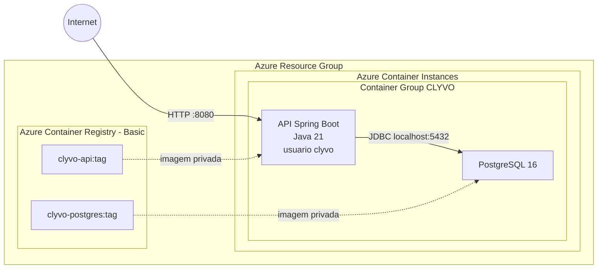

# CLYVO API

Backend REST do CLYVO, uma aplicação veterinária que conecta Tutores, Veterinários e Animais. O sistema organiza vínculos, consultas, prontuários, prescrições, exames, vacinações, notificações, conversas e dashboards analíticos do Tutor e do Veterinário.

## Sumário

- [Parte I: DevOps e Infraestrutura](#parte-i-devops-e-infraestrutura)
- [Parte II: Desenvolvimento Java](#parte-ii-desenvolvimento-java)

# Parte I: DevOps e Infraestrutura

## Descrição da Solução

A API usa Java 21, Spring Boot 4.0.6, Spring MVC, Spring Data JPA/Hibernate e PostgreSQL 16. O profile `local` usa PostgreSQL, `prod` recebe conexão exclusivamente por variáveis de ambiente e valida o schema criado por `database/script_bd.sql`, `render` usa H2 em memória com seed automático de demonstração e `test` usa H2 em memória para a suíte automatizada.

O deploy acadêmico validado segue a opção ACR + ACI aprovada pelo professor: um único Azure Container Instance/Container Group contém a API e o PostgreSQL. A API acessa o banco por `localhost:5432`; apenas a porta `8080` é pública. O PostgreSQL usa o filesystem interno do container.

> O fluxo foi validado de ponta a ponta com Docker, ACR e ACI. Como não há volume externo, recriar ou excluir o Container Group perde os dados; use somente dados fictícios de demonstração.

## Benefícios para o Negócio

- Centralização do histórico clínico dos animais.
- Comunicação persistente entre Tutor e Veterinário.
- Acompanhamento de tratamento, prescrições, exames e vacinações.
- Gestão de consultas e organização das informações de saúde animal.
- Indicadores operacionais para apoiar a tomada de decisão veterinária.
- Home consolidada para o Tutor acompanhar pets, consultas e atividades clínicas recentes.

## Arquitetura Cloud



Não fazem parte desta solução: App Service, Azure Database for PostgreSQL, VNet, NAT Gateway, Application Gateway, AKS ou dois ACIs separados.

## Pré-Requisitos

- Git.
- Docker Engine com Docker Compose.
- Azure CLI.
- Subscription Azure ativa.
- `curl` e Python 3 para os scripts.
- JDK 21 apenas para desenvolvimento/testes fora do container.
- Maven não precisa ser instalado: o repositório possui Maven Wrapper.

## Configuração

Clone o repositório real do backend:

```bash
git clone https://github.com/MuriloMacedoSilva/Api-challenge-clyvo.git
cd Api-challenge-clyvo
```

Crie o arquivo local ignorado pelo Git:

```bash
install -m 600 .env.example .env
```

Edite `.env` e substitua todos os placeholders. Campos Azure vazios são derivados automaticamente de `UNIQUE_SUFFIX`, mas podem ser preenchidos para sobrescrever os nomes. Use linhas literais `NOME=VALOR`, sem comandos, expansão de shell ou aspas. Uma senha hexadecimal longa evita diferenças de parsing entre ferramentas. Use um `UNIQUE_SUFFIX` reproduzível, contendo somente letras minúsculas e números. Use a mesma senha forte em `POSTGRES_PASSWORD` e `DB_PASSWORD` para o desenvolvimento local.

Variáveis usadas:

| Variável | Finalidade |
|---|---|
| `POSTGRES_DB`, `POSTGRES_USER`, `POSTGRES_PASSWORD` | Inicialização e acesso ao PostgreSQL |
| `DB_URL`, `DB_USERNAME`, `DB_PASSWORD` | Datasource da API fora do Compose |
| `UNIQUE_SUFFIX` | Sufixo reproduzível para nomes globais |
| `AZURE_SUBSCRIPTION_ID` | Subscription que todos os scripts conferem antes de operar |
| `AZURE_LOCATION` | Região Azure, padrão documentado `brazilsouth` |
| `RESOURCE_GROUP` | Resource Group exclusivo da entrega |
| `ACR_NAME` | Registry globalmente único |
| `ACI_NAME` | Nome do Container Group |
| `DNS_NAME_LABEL` | Label configurável do FQDN público |
| `IMAGE_TAG` | Tag explícita das duas imagens, por exemplo `v1` |

Nenhuma senha ou credencial ACR deve ser commitada.

## Execução Local

O Compose constrói e inicia `api` + `postgres`. A API usa `jdbc:postgresql://postgres:5432/clyvo`, depende do healthcheck do banco e também executa sua própria espera autenticada. O volume nomeado preexistente `clyvo-postgres-data` continua montado em `/var/lib/postgresql/data`.

```bash
docker compose build
docker compose up -d
docker compose ps
curl http://localhost:8080/tutor/ping
```

O DDL em `/docker-entrypoint-initdb.d/001-schema.sql` só é executado pelo PostgreSQL quando o volume está vazio. Volumes locais já existentes continuam com o schema mantido pelo profile `local`, cujo `ddl-auto` permanece `update`.

Seed local manual e destrutivo:

```bash
docker compose exec -T postgres sh -c 'PGPASSWORD="$POSTGRES_PASSWORD" psql -U "$POSTGRES_USER" -d "$POSTGRES_DB" -f /seed/demo-data-postgres.sql'
```

Parar sem apagar dados:

```bash
docker compose stop
docker compose start
```

Não use `docker compose down -v` se quiser preservar o volume.

## Imagens

### API

O `Dockerfile` usa `maven:3.9.15-eclipse-temurin-21` no build e `eclipse-temurin:21-jre-jammy` no runtime. Maven e fontes não ficam na imagem final. O usuário final é `clyvo`, e o script `wait-for-postgres.sh` usa o cliente PostgreSQL para confirmar `SELECT 1` antes de executar `java -jar`.

### PostgreSQL

O `Dockerfile.postgres` deriva de `postgres:16`. O schema é copiado para `/docker-entrypoint-initdb.d/001-schema.sql`. O seed não é automático: `demo-data.sql`, `demo-data-postgres.sql` e `demo-verification.sql` ficam em `/seed`.

## Schema e Profiles

`database/script_bd.sql` contém 13 tabelas correspondentes às 13 Entities atuais, com PKs identity, FKs, unicidades, `NOT NULL`, checks dos enums, `item_order`, índices e comentários PostgreSQL. Não contém `DROP`, `TRUNCATE` ou dados.

- `local`: `ddl-auto=update`, preservado para compatibilidade com bancos locais existentes.
- `prod`: `ddl-auto=validate`; o schema deve existir antes da API iniciar.
- `render`: `ddl-auto=create` sobre H2 em memória; cria um schema novo e a massa demo a cada inicialização.
- `test`: `ddl-auto=create-drop` sobre H2 em memória.

Não foi introduzido Flyway/Liquibase. Para esta entrega acadêmica, o entrypoint da imagem PostgreSQL cria o schema em volume vazio; migrations versionadas continuam recomendadas para produção real.

## Deploy gratuito no Render

O ambiente Render existe exclusivamente para o professor de Frontend testar a API sem depender da infraestrutura paga da Azure. Ele executa um Web Service Docker no plano Free, ativa o profile `render` e usa H2 em memória. Não crie Render Postgres nem configure `DB_URL`, `DB_USERNAME` ou `DB_PASSWORD` nesse serviço.

O `render.yaml` permite criar o serviço como Blueprint. Ele reutiliza o `Dockerfile` da API, configura `SPRING_PROFILES_ACTIVE=render`, limita a JVM com `JAVA_TOOL_OPTIONS=-Xms128m -Xmx384m` e usa `GET /tutor/ping` como health check. A aplicação escuta em `0.0.0.0` e usa a variável `PORT` fornecida pelo Render, com fallback local para `10000`.

Para criar pelo Dashboard sem Blueprint:

1. Crie um Web Service a partir deste repositório GitHub.
2. Selecione o runtime Docker e o plano Free.
3. Defina `SPRING_PROFILES_ACTIVE=render`.
4. Opcionalmente, defina `JAVA_TOOL_OPTIONS=-Xms128m -Xmx384m`; o Blueprint já inclui esse limite.
5. Faça o deploy e acesse a URL `https://<nome-do-servico>.onrender.com`.

Como alternativa, escolha New > Blueprint no Render e aponte para o repositório que contém `render.yaml`. O Blueprint cria somente a API, sem banco ou secrets externos.

Credenciais fictícias criadas automaticamente:

| Perfil | CPF | CRMV | Senha |
|---|---|---|---|
| Tutor demo (Mariana Oliveira) | `12345678901` | Não se aplica | `12345678` |
| Veterinário demo (Dr. Gabriel Martins) | `98765432100` | `12345/SP` | `12345678` |

O initializer exclusivo `RenderDemoDataInitializer`, ativado somente pelo profile `render`, usa repositories em uma transação para criar estados finais coerentes sem disparar notificações ou transições de negócio durante o boot. Antes de inserir, ele verifica o CPF do Tutor demo, evitando duplicação se for chamado novamente na mesma instância. A massa contém Luna, Mingau e Thor, vínculo aceito, consultas, prontuário, prescrição, exames, vacinas e uma conversa com mensagens. Esses dados deixam as listagens, os detalhes clínicos, o chat e os dashboards do Tutor e do Veterinário com conteúdo demonstrável.

### Limitações do ambiente Render

- O H2 é volátil e existe somente na memória do processo.
- Restart, redeploy ou encerramento do serviço apaga os dados; o initializer recria automaticamente a mesma massa no próximo boot.
- O serviço Free pode dormir após inatividade e a primeira requisição depois disso pode levar cerca de um minuto.
- O Render não representa produção e não deve receber dados reais.
- O deploy acadêmico oficial de DevOps continua sendo Azure ACR/ACI com PostgreSQL e permanece independente desta configuração.
- O CORS amplo já declarado pelos controllers foi preservado, portanto o frontend web pode acessar a URL pública do Render sem cadastrar um domínio ainda desconhecido.

## Login Azure Manual

O login não é automatizado:

```bash
az login
az account show
```

Se necessário, escolha explicitamente a subscription:

```bash
az account set --subscription "<SUBSCRIPTION_ID_OU_NOME>"
az account show
```

## Ordem dos Scripts

Execute a partir da raiz do backend, nesta ordem:

```bash
./azure/scripts/00-check-prerequisites.sh
./azure/scripts/01-create-resources.sh
./azure/scripts/02-build-push-images.sh
./azure/scripts/03-deploy.sh
./azure/scripts/05-status.sh
./azure/scripts/04-seed-demo.sh
./azure/scripts/06-test.sh
```

| Script | Responsabilidade |
|---|---|
| `00-check-prerequisites.sh` | Verifica Azure CLI, Docker, curl, Python, login, subscription, variáveis e nomes |
| `01-create-resources.sh` | Cria Resource Group e ACR Basic |
| `02-build-push-images.sh` | Faz login no ACR, build, tag e push das duas imagens |
| `03-deploy.sh` | Obtém credenciais, renderiza YAML temporário, cria o Container Group e mostra o FQDN |
| `04-seed-demo.sh` | Executa manualmente o seed destrutivo no container PostgreSQL |
| `05-status.sh` | Mostra recursos, containers, estados, IP e FQDN sem secrets |
| `06-test.sh` | Testa `/tutor/ping` e `/v3/api-docs` |
| `99-destroy.sh` | Remove o Resource Group após confirmação explícita |

## Comandos Principais Usados

Os scripts deixam visíveis os comandos exigidos pela disciplina. O fluxo utiliza, entre outros:

```bash
az group create --name "$RESOURCE_GROUP" --location "$AZURE_LOCATION"
az acr create --resource-group "$RESOURCE_GROUP" --name "$ACR_NAME" --sku Basic --admin-enabled true
az acr login --name "$ACR_NAME"
docker build --file Dockerfile --tag "clyvo-api:$IMAGE_TAG" .
docker build --file Dockerfile.postgres --tag "clyvo-postgres:$IMAGE_TAG" .
docker tag "clyvo-api:$IMAGE_TAG" "$ACR_NAME.azurecr.io/clyvo-api:$IMAGE_TAG"
docker tag "clyvo-postgres:$IMAGE_TAG" "$ACR_NAME.azurecr.io/clyvo-postgres:$IMAGE_TAG"
docker push "$ACR_NAME.azurecr.io/clyvo-api:$IMAGE_TAG"
docker push "$ACR_NAME.azurecr.io/clyvo-postgres:$IMAGE_TAG"
az container create --resource-group "$RESOURCE_GROUP" --file /tmp/clyvo-container-group.<temporario>.yaml
az container show --resource-group "$RESOURCE_GROUP" --name "$ACI_NAME"
az container logs --resource-group "$RESOURCE_GROUP" --name "$ACI_NAME" --container-name clyvo-api
az container exec --resource-group "$RESOURCE_GROUP" --name "$ACI_NAME" --container-name clyvo-api --exec-command whoami
```

`docker run` individual não é usado no deploy, pois o destino é um Container Group ACI. Para uma prova local opcional de usuário, depois do build:

```bash
docker run --rm --entrypoint whoami "clyvo-api:$IMAGE_TAG"
```

## Template ACI e Secrets

`azure/container-group.template.yaml` define exatamente um Container Group e dois containers. O PostgreSQL declara a porta interna `5432`, mas `ipAddress.ports` publica somente `8080`. No ACI, a API recebe:

```text
SPRING_PROFILES_ACTIVE=prod
DB_URL=jdbc:postgresql://localhost:5432/<POSTGRES_DB>
```

O PostgreSQL não recebe `PGDATA`, volume ou mount customizado. O template commitado contém apenas placeholders. `03-deploy.sh` consulta `az acr credential show`, renderiza valores como escalares JSON válidos em um arquivo `0600` sob `/tmp`, remove secrets do ambiente, chama `az container create --output none` e remove o diretório temporário via `trap`. A solução acadêmica usa o admin user do ACR pela simplicidade; credenciais não são versionadas. O label DNS usa escopo `ResourceGroupReuse` contra reutilização insegura.

O endpoint acadêmico é HTTP na porta `8080`, pois TLS/proxy está fora da arquitetura aprovada. Use somente dados fictícios durante a apresentação; esta exposição não é adequada para produção real.

## Status, Logs e Exec

```bash
source azure/scripts/_common.sh
load_config
./azure/scripts/05-status.sh

az container logs \
  --resource-group "$RESOURCE_GROUP" \
  --name "$ACI_NAME" \
  --container-name clyvo-api

az container logs \
  --resource-group "$RESOURCE_GROUP" \
  --name "$ACI_NAME" \
  --container-name clyvo-postgres
```

Entrar no PostgreSQL:

```bash
az container exec \
  --resource-group "$RESOURCE_GROUP" \
  --name "$ACI_NAME" \
  --container-name clyvo-postgres \
  --exec-command "/bin/sh"
```

Executar diretamente as consultas de verificação, sem pager:

```bash
az container exec \
  --resource-group "$RESOURCE_GROUP" \
  --name "$ACI_NAME" \
  --container-name clyvo-postgres \
  --exec-command "psql --pset=pager=off --username=$POSTGRES_USER --dbname=$POSTGRES_DB --file=/seed/demo-verification.sql"
```

Dentro do container:

```bash
psql --pset=pager=off --username="$POSTGRES_USER" --dbname="$POSTGRES_DB"
```

Consultas úteis:

```sql
SELECT * FROM animal ORDER BY id;
SELECT * FROM tb_vaccinations ORDER BY id;
SELECT a.id, a.name, t.name AS tutor
FROM animal a JOIN tutor t ON t.id = a.tutor_id
ORDER BY a.id;
```

O arquivo `/seed/demo-verification.sql` contém contagens e joins prontos:

```bash
psql --pset=pager=off --username="$POSTGRES_USER" --dbname="$POSTGRES_DB" --file=/seed/demo-verification.sql
```

## Seed no ACI

O seed é intencionalmente manual porque limpa todas as tabelas antes de recriar a massa. O script exige confirmação e aguarda uma conexão PostgreSQL autenticada:

```bash
./azure/scripts/04-seed-demo.sh
```

Internamente, o script usa `az container exec --container-name clyvo-postgres` e executa `/seed/demo-data-postgres.sql` com `psql`. O seed fornece pelo menos dois registros significativos relacionados: as vacinações V10 e Antirrábica de Luna, além do Tutor e Veterinário associados.

## CRUD Acadêmico

O par CORE validado é `Animal + Vaccination`, relacionado por `tb_vaccinations.animal_id`. Ambos possuem CREATE, READ, UPDATE e DELETE. A exclusão de Vaccination exige o Veterinário autor e vínculo `ACCEPTED` com o Tutor.

### Demonstração Disponível: Animal

Defina o endpoint retornado por `05-status.sh`:

```bash
export BASE_URL="http://<FQDN>:8080"
```

CREATE:

```bash
curl --fail --request POST "$BASE_URL/tutor/12345678901/create-animal" \
  --header 'Content-Type: application/json' \
  --data '[{"name":"Aurora Video","weight":8.4,"height":0.39,"age":3,"race":"Beagle","species":"Cachorro","history":"Registro criado durante a demonstracao."}]'
```

Anote o ID retornado e configure:

```bash
export ANIMAL_ID=<ID_RETORNADO>
```

READ:

```bash
curl --fail "$BASE_URL/tutor/12345678901/read-animals"
```

UPDATE:

```bash
curl --fail --request PUT "$BASE_URL/tutor/12345678901/animals/$ANIMAL_ID" \
  --header 'Content-Type: application/json' \
  --data '{"name":"Aurora Video","weight":8.9,"height":0.40,"age":4,"race":"Beagle","species":"Cachorro","history":"Peso atualizado durante a demonstracao."}'
```

DELETE, após os SELECTs:

```bash
curl --fail --request DELETE "$BASE_URL/tutor/12345678901/animals/$ANIMAL_ID"
```

No `psql`, após cada operação:

```sql
SELECT id, tutor_id, name, weight, height, age, race, species, history
FROM animal
WHERE id = <ANIMAL_ID>;
```

### Demonstração: Vaccination

Use um animal do seed, por exemplo Luna (`animalId=1`), e o Veterinário vinculado de CPF demonstrativo `98765432100`.

CREATE:

```bash
curl --fail --request POST "$BASE_URL/v1/vaccinations/animals/1?veterinarianCpf=98765432100" \
  --header 'Content-Type: application/json' \
  --data "{\"vaccineName\":\"Vacina Demo Video\",\"applicationDate\":\"$(date -I)\",\"nextDoseDate\":\"$(date -d '+1 year' -I)\",\"batchNumber\":\"VIDEO-001\",\"manufacturer\":\"Fabricante Demo\",\"observations\":\"Registro academico.\"}"
```

READ:

```bash
curl --fail "$BASE_URL/v1/vaccinations/veterinarian/98765432100/animals/1"
```

Anote o ID retornado como `VACCINATION_ID`. UPDATE:

```bash
export VACCINATION_ID=<ID_RETORNADO>
curl --fail --request PUT "$BASE_URL/v1/vaccinations/$VACCINATION_ID?veterinarianCpf=98765432100" \
  --header 'Content-Type: application/json' \
  --data "{\"vaccineName\":\"Vacina Demo Atualizada\",\"applicationDate\":\"$(date -I)\",\"nextDoseDate\":\"$(date -d '+1 year' -I)\",\"batchNumber\":\"VIDEO-002\",\"manufacturer\":\"Fabricante Demo\",\"observations\":\"Atualizada pela API.\"}"
```

SELECT correspondente:

```sql
SELECT id, animal_id, veterinarian_id, vaccine_name, application_date,
       next_dose_date, batch_number, manufacturer, observations
FROM tb_vaccinations
WHERE id = <VACCINATION_ID>;
```

DELETE e SELECT de confirmação:

```bash
curl --fail --request DELETE "$BASE_URL/v1/vaccinations/$VACCINATION_ID?veterinarianCpf=98765432100"
```

```sql
SELECT COUNT(*) FROM tb_vaccinations WHERE id = <VACCINATION_ID>;
```

## Validação do Container Non-Root

```bash
az container exec \
  --resource-group "$RESOURCE_GROUP" \
  --name "$ACI_NAME" \
  --container-name clyvo-api \
  --exec-command "whoami"
```

Resultado esperado: `clyvo`, nunca `root` ou `admin`. Também pode executar `--exec-command "id"`.

## Validação App e Banco

Para cada mutação, execute a chamada HTTP e o SELECT correspondente no PostgreSQL. Isso demonstra a integração entre os dois containers em nuvem. Não use restart como teste: o filesystem é interno e não oferece durabilidade após recriação do Container Group.

## Testes Java

Os testes não dependem de Docker/PostgreSQL porque ativam o profile `test` com H2:

```bash
./mvnw test
```

## Limpeza

Se o Resource Group contiver apenas esta entrega, remova tudo para interromper cobranças:

```bash
./azure/scripts/99-destroy.sh
```

O script exige digitar o nome exato do Resource Group, executa `az group delete --yes` e confirma `az group exists: false`.

---

# Parte II: Desenvolvimento Java

## Visão Geral

A API implementa os casos de uso do CLYVO em uma aplicação Spring Boot organizada por domínio e camadas. Os controllers expõem recursos REST, os services concentram regras de negócio e transações, e os repositories usam Spring Data JPA para persistência em PostgreSQL ou H2, conforme o profile ativo.

Os fluxos atendem dois perfis:

- **Tutor:** gerencia seus animais, vínculos, consultas, notificações, histórico clínico, vacinações e conversas.
- **Veterinário:** acompanha Tutores vinculados, gerencia atendimentos e dados clínicos, registra vacinações, utiliza o chat e consulta indicadores operacionais.

## Stack Java

| Tecnologia | Versão ou escopo | Finalidade |
|---|---|---|
| Java | 21 | Linguagem e runtime da aplicação |
| Spring Boot | 4.0.6 | Configuração, inicialização e gerenciamento da aplicação |
| Spring WebMVC | Gerenciada pelo Spring Boot | Controllers e endpoints REST |
| Spring Data JPA / Hibernate | Gerenciada pelo Spring Boot | Persistência e consultas |
| Jakarta Bean Validation | Gerenciada pelo Spring Boot | Validação dos DTOs de entrada |
| PostgreSQL | Driver runtime | Banco dos profiles `local` e `prod` |
| H2 | Driver runtime | Banco dos profiles `render` e `test` |
| Springdoc OpenAPI | 3.0.2 | OpenAPI e Swagger UI |
| Lombok | Gerenciada pelo Spring Boot | Redução de código repetitivo nas classes Java |
| Maven Wrapper | Maven 3.9.15 | Build e execução sem instalação global do Maven |

O artefato Maven é `com.FirstApiChallenge:api:0.0.1-SNAPSHOT` e o pacote-base é `com.FirstApiChallenge.api`.

## Arquitetura do Código

```text
src/main/java/com/FirstApiChallenge/api/
|-- config/       # Inicialização exclusiva do ambiente Render
|-- controller/   # Endpoints HTTP e montagem de ResponseEntity
|-- dto/          # Contratos de entrada e saída
|-- enums/        # Estados e tipos persistidos pelo domínio
|-- exception/    # Exceções e tratamento global de erros
|-- model/        # Entidades JPA
|-- repository/   # Persistência, projections, consultas e locks
`-- service/      # Casos de uso, autorização de domínio e transações
```

O fluxo principal de uma requisição segue:

```text
Cliente HTTP
-> Controller
-> Service
-> Repository
-> PostgreSQL ou H2
```

Decisões presentes no código:

- controllers delegam regras de negócio aos services;
- services usam `@Transactional` nas fronteiras que alteram o domínio;
- repositories estendem interfaces do Spring Data JPA;
- os módulos clínicos retornam DTOs, evitando expor grafos de entidades JPA;
- listas vazias normalmente retornam `200 []`;
- operações que criam dados clínicos e notificações usam a mesma transação;
- associações clínicas são carregadas de forma `LAZY` e consultas específicas usam projections, `EntityGraph` ou locks quando necessário.

## Modelo de Domínio

A aplicação possui 13 entidades JPA:

| Entidade | Papel e relacionamentos principais |
|---|---|
| `Tutor` | Responsável pelos animais; relacionamento `1:N` com `Animal` |
| `Veterinarian` | Profissional associado a vínculos, consultas e registros clínicos |
| `Animal` | Pertence a um Tutor; o nome é único dentro do mesmo Tutor |
| `VeterinarianTutorLink` | Liga Veterinário e Tutor com estado `PENDING`, `ACCEPTED` ou `REJECTED` |
| `Appointment` | Relaciona Animal, Tutor e Veterinário em uma consulta |
| `MedicalRecord` | Prontuário de uma consulta; existe no máximo um por Appointment |
| `Prescription` | Prescrição única de um prontuário |
| `PrescriptionItem` | Medicamento ordenado pertencente a uma Prescription |
| `Exam` | Exame solicitado a partir de um prontuário |
| `Vaccination` | Registro longitudinal ligado diretamente a Animal e Veterinário |
| `Notification` | Evento destinado a Tutor ou Veterinário |
| `Conversation` | Conversa única para cada par Tutor/Veterinário |
| `Message` | Mensagem pertencente a uma Conversation |

Relacionamentos centrais:

```text
Tutor 1 ----- N Animal

Veterinarian 1 ----- N VeterinarianTutorLink N ----- 1 Tutor

Appointment N ----- 1 Animal
Appointment N ----- 1 Tutor
Appointment N ----- 1 Veterinarian

MedicalRecord 1 ----- 1 Appointment
MedicalRecord N ----- 1 Animal
MedicalRecord N ----- 1 Veterinarian

Prescription 1 ----- 1 MedicalRecord
Prescription 1 ----- N PrescriptionItem

Exam N ----- 1 MedicalRecord

Vaccination N ----- 1 Animal
Vaccination N ----- 1 Veterinarian

Tutor 1 ----- N Conversation N ----- 1 Veterinarian
Conversation 1 ----- N Message
```

## Autenticação Atual

A autenticação é simplificada para fins acadêmicos.

- não há Spring Security, JWT, sessão HTTP ou refresh token;
- o login compara CPF e senha diretamente com os valores persistidos;
- senhas ainda são armazenadas em texto puro;
- DTOs antigos de Tutor e Veterinário ainda retornam o campo `password`;
- CPF, CRMV e IDs recebidos em path ou query identificam o ator da operação;
- os controllers aceitam CORS de qualquer origem.

As validações de propriedade, autoria e vínculo `ACCEPTED` protegem regras de negócio específicas, mas não substituem autenticação e autorização reais. Use somente dados fictícios e não exponha esta versão como uma API de produção.

## Funcionalidades e Regras

### Tutores e Animais

- cadastro e login simples de Tutor;
- consulta de Tutor por CPF;
- cadastro, listagem, edição e exclusão de Animal por ID;
- um Tutor acessa apenas seus próprios Animais;
- idade, peso e altura são obrigatórios e positivos;
- um Tutor não pode ter dois Animais com o mesmo nome.

### Veterinários e Vínculos

- cadastro, login e consulta de Veterinário;
- solicitação de vínculo por CRMV e CPF do Tutor;
- aceite ou rejeição pelo Tutor;
- uma solicitação rejeitada reutiliza o mesmo registro ao ser reenviada;
- operações veterinárias sobre dados do Tutor exigem vínculo `ACCEPTED` quando indicado pelo domínio.

### Consultas

- o Tutor agenda apenas Animal próprio com Veterinário vinculado;
- a data deve estar no futuro;
- não pode existir outra consulta ativa do Veterinário no mesmo horário exato;
- o Veterinário confirma consultas pendentes;
- Tutor ou Veterinário relacionado pode cancelar consultas ativas;
- a criação do prontuário conclui a consulta confirmada.

Estados de Appointment:

```text
PENDING -> CONFIRMED -> COMPLETED
    |           |
    `-----------+-> CANCELLED
```

### Prontuários, Prescrições e Exames

- existe no máximo um prontuário por consulta;
- o prontuário registra diagnóstico, descrição, peso, temperatura e observações;
- existe no máximo uma prescrição por prontuário;
- uma prescrição contém um ou mais itens ordenados;
- exames começam como `REQUESTED` e podem passar para `COMPLETED` ou `CANCELLED`;
- apenas o Veterinário responsável, enquanto vinculado, altera os registros clínicos;
- não há upload de laudos, imagens, PDFs ou anexos.

### Vacinações

- Vaccination pertence diretamente ao Animal e ao Veterinário autor;
- a data de aplicação não pode estar no futuro;
- a próxima dose é opcional e deve ser posterior à aplicação;
- a mesma vacina pode aparecer em várias aplicações;
- Veterinários vinculados podem consultar o histórico;
- somente o autor, ainda vinculado, pode editar ou excluir o registro;
- a criação gera uma notificação para o Tutor.

### Chat

- existe no máximo uma Conversation por par Tutor/Veterinário;
- criar conversa e enviar mensagem exige vínculo `ACCEPTED`;
- o histórico permanece disponível aos participantes após a inativação do vínculo;
- novos envios ficam bloqueados enquanto o vínculo estiver inativo;
- mensagens são ordenadas por envio e podem ser marcadas como lidas até um ID;
- não existem edição, exclusão, anexos, grupos ou WebSocket.

### Dashboard do Veterinário

O dashboard é calculado sob demanda e não possui tabela própria. Ele apresenta:

- Tutores com vínculo aceito;
- pacientes ativos;
- consultas do dia e contadores por status;
- exames pendentes;
- consultas concluídas nos últimos seis meses;
- distribuição dos pacientes por espécie;
- cinco próximas consultas pendentes ou confirmadas.

### Dashboard do Tutor

O dashboard também é calculado sob demanda, sem tabela ou cache próprio. Ele apresenta:

- quantidade de pets, consultas de hoje e consultas pendentes;
- Veterinários com vínculo aceito;
- exames solicitados e registros vacinais cuja próxima dose está prevista para hoje ou data anterior;
- a próxima consulta pendente ou confirmada;
- até cinco atividades recentes derivadas de consultas concluídas, prontuários, prescrições, resultados de exame e vacinações.

A métrica vacinal é uma contagem objetiva de registros por `nextDoseDate`; ela não representa diagnóstico de atraso, cobertura ou vacinação completa.

## Endpoints

### Tutor e Animal

```text
GET    /tutor/ping
POST   /tutor
POST   /tutor/login
GET    /tutor/{cpf}
POST   /tutor/{cpf}/create-animal
GET    /tutor/{cpf}/read-animals
PUT    /tutor/{cpf}/animals/{animalId}
DELETE /tutor/{cpf}/animals/{animalId}
```

`POST /tutor/{cpf}/create-animal` recebe uma coleção de Animais, mesmo quando apenas um registro é criado.

### Veterinário

```text
POST /veterinarian
POST /veterinarian/login
GET  /veterinarian/{cpf}
GET  /veterinarian/{cpf}/tutors
PUT  /veterinarian/{cpf}/animals/{animalId}
```

### Vínculos

```text
POST  /v1/links/request?crmvNumber=&tutorCpf=
PATCH /v1/links/{linkId}/respond?tutorCpf=&accept=
GET   /v1/links/pending?tutorCpf=
GET   /v1/links/veterinarian/{veterinarianCpf}/tutor/{tutorCpf}/animals
GET   /v1/links/veterinarian/{veterinarianCpf}/tutors
```

### Notificações

```text
GET    /v1/notifications/tutor/{cpf}
GET    /v1/notifications/veterinarian/{cpf}
DELETE /v1/notifications/tutor/{cpf}
DELETE /v1/notifications/veterinarian/{cpf}
PATCH  /v1/notifications/{id}/read
```

### Consultas

```text
POST  /v1/appointments/tutor/{tutorCpf}
GET   /v1/appointments/tutor/{tutorCpf}
GET   /v1/appointments/tutor/{tutorCpf}/veterinarians
GET   /v1/appointments/veterinarian/{veterinarianCpf}
PATCH /v1/appointments/{appointmentId}/confirm?veterinarianCpf=
PATCH /v1/appointments/{appointmentId}/cancel/tutor?tutorCpf=
PATCH /v1/appointments/{appointmentId}/cancel/veterinarian?veterinarianCpf=
```

### Prontuários

```text
POST /v1/medical-records/appointments/{appointmentId}?veterinarianCpf=
PUT  /v1/medical-records/{recordId}?veterinarianCpf=
GET  /v1/medical-records/tutor/{tutorCpf}/animals/{animalId}
GET  /v1/medical-records/veterinarian/{veterinarianCpf}/animals/{animalId}
```

### Prescrições

```text
POST /v1/prescriptions/medical-records/{medicalRecordId}?veterinarianCpf=
PUT  /v1/prescriptions/{prescriptionId}?veterinarianCpf=
GET  /v1/prescriptions/tutor/{tutorCpf}/medical-records/{medicalRecordId}
GET  /v1/prescriptions/veterinarian/{veterinarianCpf}/medical-records/{medicalRecordId}
```

Quando o prontuário não possui prescrição, os endpoints de consulta retornam `204 No Content`.

### Exames

```text
POST  /v1/exams/medical-records/{medicalRecordId}?veterinarianCpf=
PUT   /v1/exams/{examId}?veterinarianCpf=
PATCH /v1/exams/{examId}/result?veterinarianCpf=
PATCH /v1/exams/{examId}/cancel?veterinarianCpf=
GET   /v1/exams/tutor/{tutorCpf}/medical-records/{medicalRecordId}
GET   /v1/exams/veterinarian/{veterinarianCpf}/medical-records/{medicalRecordId}
GET   /v1/exams/tutor/{tutorCpf}/animals/{animalId}
GET   /v1/exams/veterinarian/{veterinarianCpf}/animals/{animalId}
```

### Vacinações

```text
POST   /v1/vaccinations/animals/{animalId}?veterinarianCpf=
PUT    /v1/vaccinations/{vaccinationId}?veterinarianCpf=
DELETE /v1/vaccinations/{vaccinationId}?veterinarianCpf=
GET    /v1/vaccinations/tutor/{tutorCpf}/animals/{animalId}
GET    /v1/vaccinations/veterinarian/{veterinarianCpf}/animals/{animalId}
```

### Chat

```text
POST  /v1/conversations/tutor/{tutorCpf}/veterinarians/{veterinarianCpf}
POST  /v1/conversations/veterinarian/{veterinarianCpf}/tutors/{tutorCpf}
GET   /v1/conversations/tutor/{tutorCpf}
GET   /v1/conversations/veterinarian/{veterinarianCpf}
GET   /v1/conversations/tutor/{tutorCpf}/contacts
GET   /v1/conversations/veterinarian/{veterinarianCpf}/contacts
GET   /v1/conversations/{conversationId}/tutor/{tutorCpf}
GET   /v1/conversations/{conversationId}/veterinarian/{veterinarianCpf}
GET   /v1/conversations/{conversationId}/messages/tutor/{tutorCpf}
GET   /v1/conversations/{conversationId}/messages/veterinarian/{veterinarianCpf}
POST  /v1/conversations/{conversationId}/messages/tutor/{tutorCpf}
POST  /v1/conversations/{conversationId}/messages/veterinarian/{veterinarianCpf}
PATCH /v1/conversations/{conversationId}/read/tutor/{tutorCpf}?upToMessageId=
PATCH /v1/conversations/{conversationId}/read/veterinarian/{veterinarianCpf}?upToMessageId=
```

### Dashboard

```text
GET /v1/dashboards/veterinarian/{veterinarianCpf}
GET /v1/dashboards/tutor/{tutorCpf}
```

## Respostas e Tratamento de Erros

As respostas de erro tratadas pelo `GlobalExceptionHandler` seguem, em geral, este formato:

```json
{
  "timestamp": "2026-09-15T10:00:00",
  "status": 404,
  "error": "Not Found",
  "message": "Recurso não encontrado"
}
```

Semântica usada pela API:

| Status | Uso principal |
|---|---|
| `200 OK` | Consultas, atualizações e ações concluídas |
| `201 Created` | Criação dos principais recursos |
| `204 No Content` | Exclusões, respostas sem corpo e prescrição ausente |
| `400 Bad Request` | Payload, validação ou transição inválida |
| `403 Forbidden` | Propriedade, autoria ou vínculo insuficiente |
| `404 Not Found` | Recurso principal inexistente |
| `409 Conflict` | Duplicidade ou conflito de integridade |
| `500 Internal Server Error` | Falha inesperada com mensagem genérica |

Exceções ao envelope JSON:

- os endpoints legados de login retornam `401` com texto simples quando a autenticação falha;
- `GET /veterinarian/{cpf}` pode retornar `404` sem corpo;
- coleções vazias normalmente retornam `200 []`.

## Profiles Spring

| Profile | Banco | Comportamento |
|---|---|---|
| `local` | PostgreSQL | Profile default, `ddl-auto=update` e SQL visível |
| `prod` | PostgreSQL | Datasource obrigatório por variáveis e `ddl-auto=validate` |
| `render` | H2 em memória | `ddl-auto=create` e seed automático de demonstração |
| `test` | H2 em memória | `ddl-auto=create-drop`, ativado automaticamente nos testes |

Os profiles são do Spring. Não existem profiles Maven definidos no `pom.xml`.

## Desenvolvimento Local com Maven

### Pré-requisitos

- JDK 21;
- Docker, caso o PostgreSQL seja iniciado pelo Compose;
- porta `5432` disponível para o banco;
- porta `8080` disponível para a API.

O Maven não precisa ser instalado globalmente porque o projeto inclui `mvnw` e `mvnw.cmd`.

### Banco em container e API pelo Maven

O Compose usa `clyvo` como senha default do PostgreSQL, enquanto `application-local.properties` possui outro fallback. Alinhe a variável da aplicação ao iniciar pelo Maven:

```bash
docker compose up -d postgres
DB_PASSWORD=clyvo ./mvnw spring-boot:run
```

Se um `.env` personalizado foi criado, exporte `DB_URL`, `DB_USERNAME` e `DB_PASSWORD` para o processo Maven. O arquivo `.env` é lido pelo Docker Compose, mas não é carregado automaticamente pelo Spring Boot.

Teste a aplicação:

```bash
curl http://localhost:8080/tutor/ping
```

### Build e JAR

```bash
./mvnw clean package
java -jar target/api-0.0.1-SNAPSHOT.jar --spring.profiles.active=local
```

Para empacotar sem executar a suíte:

```bash
./mvnw clean package -DskipTests
```

O profile `prod` exige obrigatoriamente `DB_URL`, `DB_USERNAME` e `DB_PASSWORD` e valida o schema antes de iniciar.

## OpenAPI e Swagger

Com a aplicação em execução:

- OpenAPI JSON: `http://localhost:8080/v3/api-docs`
- Swagger UI: `http://localhost:8080/swagger-ui.html`

A especificação é inferida dos controllers e DTOs pelo Springdoc. O projeto ainda não possui descrições customizadas com `@Operation`, `@Tag` ou `@Schema`.

## Testes Automatizados

O profile `test` é ativado por `src/test/resources/application.properties` e usa H2 em memória. PostgreSQL e Docker não são necessários para executar a suíte:

```bash
./mvnw test
```

O código-fonte atual contém 76 testes distribuídos entre:

| Área | Quantidade |
|---|---:|
| Chat | 15 |
| Vacinação | 15 |
| Dashboard do Veterinário | 13 |
| Dashboard do Tutor | 19 |
| Consultas | 3 |
| Prontuários | 3 |
| Prescrições | 3 |
| Exames | 3 |
| Contexto da aplicação | 1 |
| Reexecução do seed H2 | 1 |

A maior parte da suíte testa services com contexto Spring. O dashboard também possui cobertura HTTP com MockMvc. Não há testes dedicados para autenticação, Tutor, Veterinário, vínculos, notificações e para a maioria dos controllers.

## Limitações Conhecidas

- autenticação sem Spring Security, JWT ou sessão;
- senhas persistidas e retornadas em texto puro;
- CORS aberto para qualquer origem;
- identidade baseada em CPF, CRMV e IDs informados pelo cliente;
- ausência de paginação em listagens, históricos e mensagens;
- ausência de Flyway ou Liquibase;
- datas e horários sem tratamento uniforme de timezone;
- CPF, e-mail, CNPJ e CRMV sem constraints de unicidade no banco;
- conflito de agenda baseado apenas no mesmo `scheduledAt`, sem duração de consulta;
- exclusão de Animal sujeita a conflito de FK quando já existem dados clínicos;
- Swagger habilitado também no profile `prod`;
- ausência de anexos, laudos, imagens e PDFs;
- chat baseado em REST, sem WebSocket;
- banco do ACI sem durabilidade após recriação do Container Group;
- banco H2 do Render recriado a cada nova instância.

## Próximas Evoluções Técnicas

- implementar autenticação real com hash de senha e autorização por usuário autenticado;
- adotar migrations versionadas para PostgreSQL;
- adicionar paginação e filtros aos históricos;
- padronizar datas, horários e timezone;
- ampliar testes HTTP e testes de integração com PostgreSQL;
- remover senhas dos DTOs antigos;
- avaliar persistência externa para ambientes de produção.
